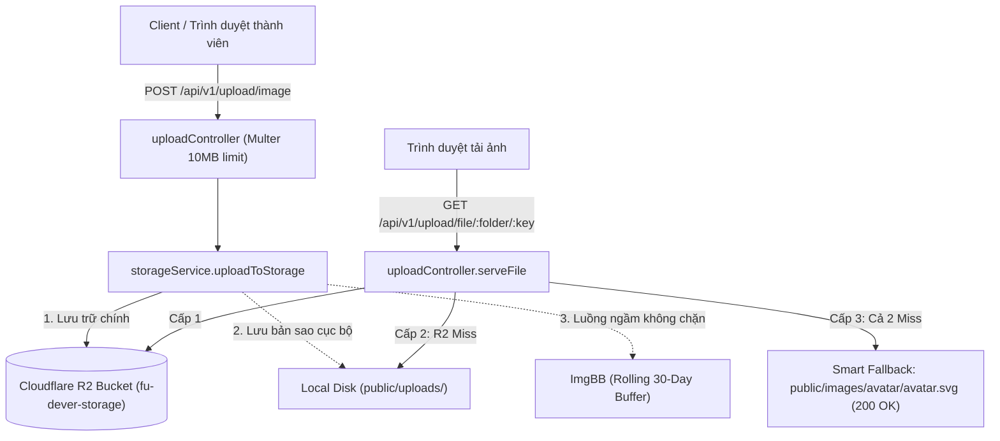

# ⚙️ FU-DEVER Core Backend & API Gateway

<p align="center">
  
</p>

<p align="center">
  <b>Trung tâm dữ liệu, Xác thực & Cầu nối API chính thức của FU-DEVER</b><br />
  <i>Đại học FPT Đà Nẵng · "WORK HARD - PLAY HARD"</i>
</p>

<p align="center">
  <a href="https://dever-backend-production.up.railway.app/health"></a>
  <a href="https://github.com/fudever-club/dever-backend"></a>
  
  
  
  
  
</p>

---

## 🌐 Tổng Quan Phân Hệ (Overview)

`dever-backend` là hạt nhân xử lý dữ liệu và cổng API tập trung cho toàn bộ hệ sinh thái Web FU-DEVER:
- **Xác thực & Bảo mật (Auth & Security):** JWT Token, mã hóa mật khẩu Bcrypt, phân quyền theo vai trò (User, Member, Admin, President).
- **Hệ thống Gamification & Điểm danh vọng:** Bảng xếp hạng Hall of Fame, chuỗi ngày Streak, tính toán EXP tự động khi giải bài LeetCode, hoàn thiện hồ sơ hoặc xuất bản dự án/blog.
- **Kiến Trúc Lưu Trữ Đám Mây Đa Tầng (Dual Cloud Storage):**
  - **Cloudflare R2 (Main Storage & CDN):** Lưu trữ vĩnh viễn, phát file streaming tốc độ cao với header `Cache-Control: public, max-age=31536000, immutable`, không tốn phí truyền tải (Zero Egress Fees).
  - **Local Disk Redundancy:** Tự động ghi bản sao cục bộ vào `public/uploads/` đề phòng mất kết nối internet.
  - **ImgBB Disaster Recovery Buffer:** Tự động đẩy bản sao lưu ngầm (non-blocking) lên ImgBB với cờ tự hủy sau 30 ngày (`expiration=2592000`), bảo toàn dữ liệu nếu có sự cố khẩn cấp.
  - **Smart Avatar Fallback:** Tự động phục vụ Icon User tối giản chuẩn SVG (`HTTP 200 OK`) nếu không tìm thấy key ảnh đại diện, chống vỡ giao diện tuyệt đối.
- **Cầu nối Telegram Bot Automation (@Fudever_bot):**
  - Tự động báo động sự cố trầm trọng thông minh (Smart Debounced Alerting chống spam).
  - Tương tác 2 chiều (Pocket DevOps Bot): `/health`, `/stats`, `/errors`, `/clearcache`.
  - **Phê duyệt dự án 1-Click (Interactive Inline Buttons):** Khi có thành viên gửi dự án mới, bot gửi thông báo tức thời về Admin kèm 2 nút bấm: `✅ Phê duyệt (+150 EXP)` (tự động trao huy hiệu *Core Contributor*) và `❌ Từ chối / Ẩn`, kèm liên kết trực tiếp tới trang *Nội dung cộng đồng & Alumni* trên Admin Dashboard.
- **Bộ nhớ đệm siêu tốc (In-Memory Caching):** Phản hồi < 5ms cho các API đọc nhiều (`/blogs`, `/leetcode`, `/events`, `/resources`), tự động xóa cache (auto-invalidation) tức thì khi dữ liệu thay đổi.

---

## ☁️ Kiến Trúc Lưu Trữ & Upload API (Storage Architecture)



### Endpoints Tải Lên & Truy Xuất Tệp:
- `POST /api/v1/upload/image`: Tải lên hình ảnh (tối đa 10MB, hỗ trợ `file`, `image`, `avatar`, `banner`).
- `POST /api/v1/upload/document`: Tải lên tài liệu học thuật / slide PE (tối đa 30MB: PDF, ZIP, PPTX, DOCX, XLSX).
- `POST /api/v1/upload/audio`: Tải lên âm thanh (tối đa 25MB: MP3, WAV, OGG, M4A, AAC, FLAC).
- `GET /api/v1/upload/file/*`: Stream dữ liệu tệp công khai từ Cloudflare R2 / Local Disk kèm caching 1 năm.

---

## 🚀 Điểm Kiểm Tra Trạng Thái & Điều Hành (Health, Caching & DevOps Bot)

- **Liveness Health Check:** `GET /health` ➔ `{"status": "ok"}`
- **Readiness Check (MongoDB Connection):** `GET /ready` ➔ `{"status": "ready"}`
- **Bộ nhớ đệm Route (HTTP Headers):** Phản hồi các header `X-Cache: HIT` hoặc `X-Cache: MISS` kèm `Cache-Control: public, max-age=60, stale-while-revalidate=30`.
- **Tài liệu API (Swagger Docs):** `GET /docs` khi chạy ở chế độ dev.
- **Telegram Pocket DevOps Bot:**
  - `/health`: Trả về Uptime, Database readiness, RAM RSS/Heap, Tỉ lệ trúng Cache.
  - `/stats`: Báo cáo số lượng thành viên, bài viết blog chờ duyệt, quỹ CLB.
  - `/errors`: Xem 5 lỗi mới nhất trong Circular Error Buffer.
  - `/clearcache [group]`: Xóa cache khẩn cấp từ xa.
  - Endpoint Webhook: `POST /api/v1/telegram/webhook`
  - Ingestion báo cáo lỗi: `POST /api/v1/telemetry/report-error`

---

## 💻 Cài Đặt & Chạy Cục Bộ (Local Development)

### Yêu cầu:
- Node.js 20+
- Chuỗi kết nối MongoDB Atlas (hoặc MongoDB Local)

### 1. Cài đặt dependencies:
```bash
git clone https://github.com/fudever-club/dever-backend.git
cd dever-backend
npm ci
```

### 2. Cấu hình biến môi trường:
Tạo file `.env` tại thư mục gốc:
```env
# Application
PORT=5000
NODE_ENV=development

# MongoDB Connection
DB_URI=mongodb+srv://<username>:<password>@cluster.mongodb.net/?appName=FU-DEVER

# JWT Security
APP_SECRET=fu_dever_secret_key_2026_super_secure
JWT_SECRET=fu_dever_secret_key_2026_super_secure
JWT_TTL=1d
JWT_REMEMBER_TTL=30d

# CORS & Domain Routing
CORS_ORIGINS=http://localhost:3000,http://localhost:3002,http://localhost:3003,https://fudever.com,https://client.fudever.com,https://admin.fudever.com
LANDING_URL=https://fudever.com
CLIENT_URL=https://client.fudever.com
ADMIN_URL=https://admin.fudever.com

# Cloudflare R2 Storage (S3-Compatible)
R2_ACCOUNT_ID=0cf4dda6c36698e80db232829cf2ecce
R2_ACCESS_KEY_ID=ac51419c5e068e6665276b814f24dfdb
R2_SECRET_ACCESS_KEY=1744c1ff8af08b9a42a9566e3540dba846803612527e13a275e9a6821393b2be
R2_BUCKET_NAME=fu-dever-storage
R2_ENDPOINT=https://0cf4dda6c36698e80db232829cf2ecce.r2.cloudflarestorage.com
R2_PUBLIC_URL=https://0cf4dda6c36698e80db232829cf2ecce.r2.cloudflarestorage.com/fu-dever-storage

# ImgBB Disaster Recovery Backup (Temporary 30-Day Rolling Buffer)
IMGBB_API_KEY=28cd81fb0d57df8105ecd387cc23be60
IMGBB_EXPIRATION_SECONDS=2592000

# Telegram Automation Bridge (@Fudever_bot)
TELEGRAM_BOT_TOKEN=8654509084:AAH7GQSE7AE_O390qVMz14-rOP_eMDkepnc
TELEGRAM_ADMIN_CHAT_ID=7465099987
TELEGRAM_NOTIFICATIONS_ENABLED=true
```

### 3. Khởi chạy máy chủ API:
```bash
npm run dev
```
API sẽ lắng nghe tại: `http://localhost:5000`

---

## 🧪 Đóng Gói & Triển Khai (Build & Deploy)

```bash
# Biên dịch TypeScript sang JavaScript
npm run build

# Khởi chạy bản dựng Production
npm run start
```

---

## 📄 Bản Quyền & Giấy Phép (License)

Dự án được phát triển và duy trì bởi **Ban Kỹ Thuật Câu lạc bộ Lập trình FU-DEVER** - Đại học FPT Đà Nẵng.  
Phát hành theo giấy phép [MIT License](LICENSE).
